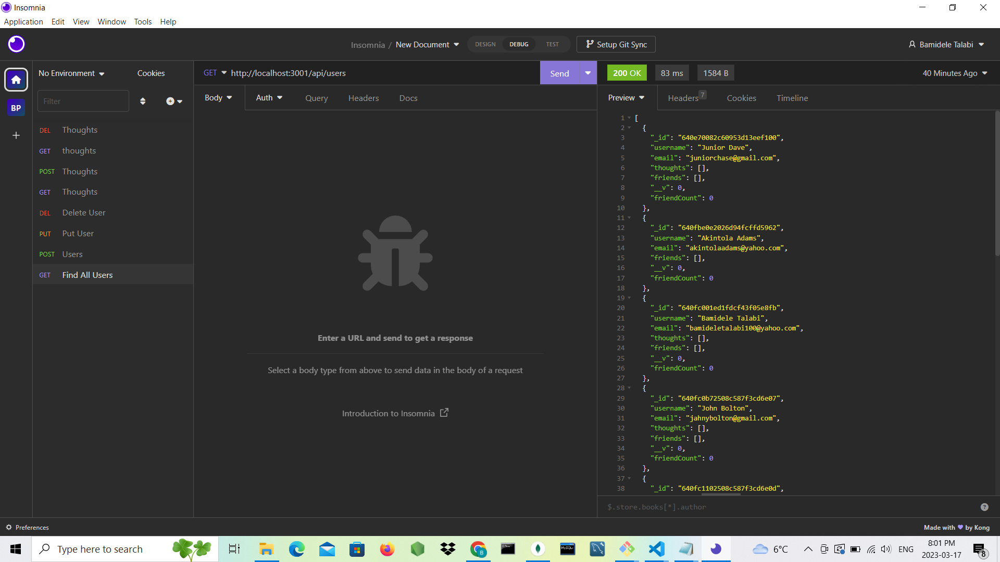
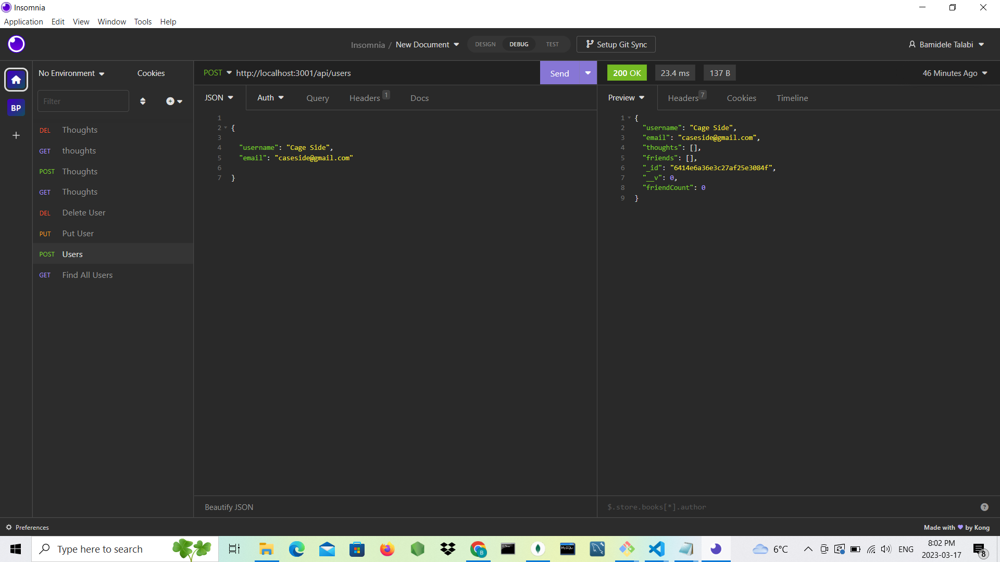
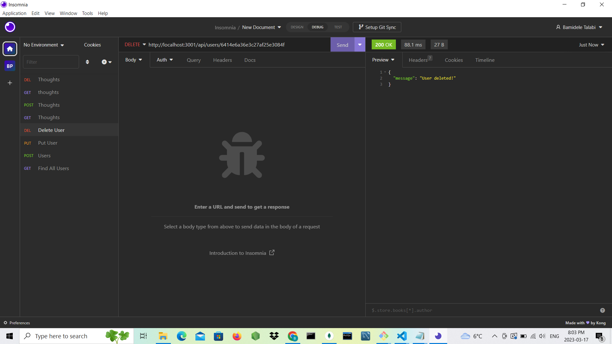

# NoSQL: SOcial Network API

The goal of the assignment is to build an API for a social network web application where users will share their thoughts, react to friends' thoughts and to create list of friends. The application makes used of Node js, Express.js for routing, MongoDB for database, Mongoose ODM and nodemon for automatic server restart if any changes are in the code. 

The server is started in node js and Mongoose models are synced to the MongoDB database. When a user opens GET, POST, DELETE and PUT routes in Insomnia software for users and thoughts, the user will get data in JSON format depending of the users' requests for any of the routes.

 ## Installed Packages

Express.js  https://www.npmjs.com/package/express
Mongoose https://www.npmjs.com/package/mongoose 
Nodemon https://www.npmjs.com/package/nodemon
Insomnia https://insomnia.rest/

## Generated images

## URL of the GitHub repository

https://github.com/Bamidele100/social-network-API.git

## walkthrough video
